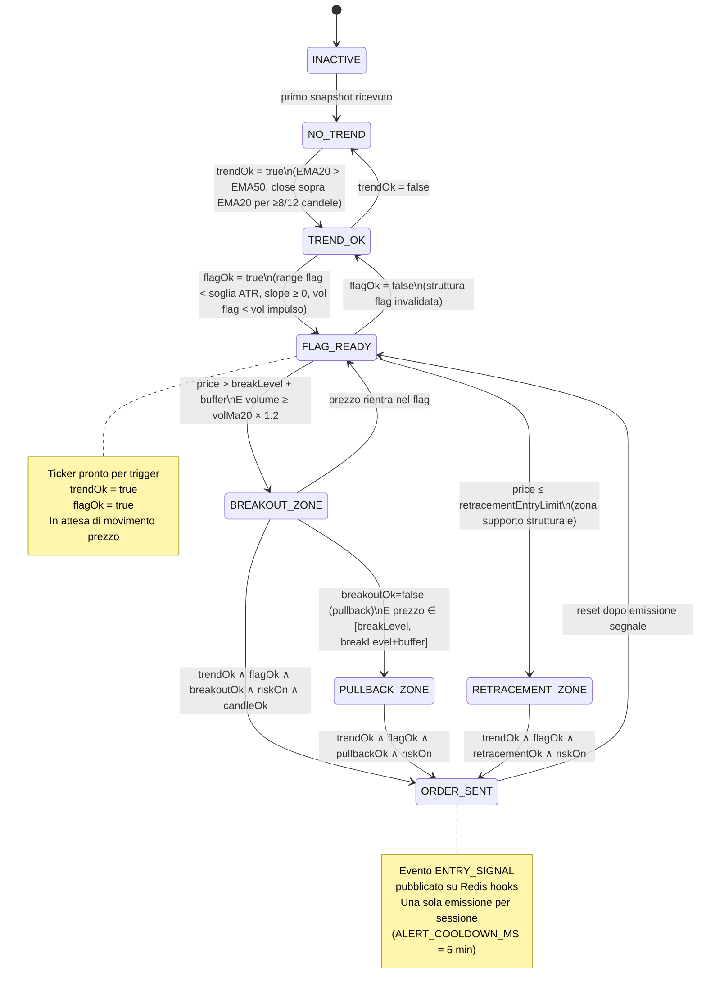

# State Machine — Decision Engine

Durante la Fase 6 (Live Daily Update), il `decision-engine` mantiene per ogni ticker un insieme di flag booleani che insieme definiscono lo **stato corrente** del ticker nella pipeline di segnali. Questo documento descrive la macchina a stati finiti che governa le transizioni.

---

## Diagramma degli stati

---

## Significato dei flag

| Flag | Fonte | Condizione (dal codice `zones.js` e `live-manager.js`) |
|---|---|---|
| `trendOk` | Spot-finder (Fase 5) | EMA20 > EMA50 sull'ultimo bar **e** chiuso sopra EMA20 per almeno `trendMinAbove` (default 8) delle ultime 12 candele |
| `flagOk` | Spot-finder (Fase 5) + guardia live | Range delle ultime 20 candele < `max(flagAtrK × ATR, flagPctK × prezzo)` **e** slope ≥ `−max(0.05×ATR, 0.0005×prezzo)` **e** vol media flag < 90% vol media impulso. Guardia live: prezzo ≥ `flagLow` |
| `breakoutOk` | Live (ogni tick) | `price > breakLevel + buffer` **e** volume ≥ `volMa20 × 1.2` |
| `pullbackOk` | Live (ogni tick) | breakout già avvenuto in precedenza **e** `breakLevel ≤ price ≤ breakLevel + buffer` |
| `retracementOk` | Live (ogni tick) | `price ≤ retracementEntryLimit` (zona supporto da analisi strutturale Fase 5) |

**Parametri default (da `constants.js`):**

| Parametro | Default | Significato |
|---|---|---|
| `flagBars` | 20 | Numero candele per calcolo range flag |
| `flagAtrK` | 1.3 | Moltiplicatore ATR per soglia range flag |
| `flagPctK` | 0.0025 | Soglia percentuale alternativa (0.25% del prezzo) |
| `atrPeriod` | 20 | Periodo ATR |
| `trendBars` | 12 | Finestra per il check EMA20 |
| `trendMinAbove` | 8 | Minimo di close sopra EMA20 sulla finestra |
| `impulseBars` | 80 | Finestra per l'impulso prima del flag |
| `volMult` | 1.2 | Moltiplicatore volume per breakout |

---

## Da solo TrendOk: esiste una sequenza di candele per abilitare gli altri stati?

**Sì, ma con un vincolo importante.**

`flagOk` **non viene ricalcolato intraday** — viene letto dallo snapshot della Fase 5 (spot-finder), eseguito una volta al giorno. Questo significa che:

- Se la Fase 5 ha prodotto `flagOk = false` per un ticker, durante la sessione live il ticker **non può mai passare a FLAG_READY** indipendentemente da quante candele arrivino.
- Se la Fase 5 ha prodotto `flagOk = true`, il ticker parte già da FLAG_READY all'inizio della sessione (non deve "guadagnarselo" intraday).

L'**unica guardia live su `flagOk`** è la condizione `flagIntact`: se il prezzo scende sotto `flagLow` (il minimo delle ultime 20 candele del flag calcolato in Fase 5), `flagOk` viene azzerato per quella sessione.

Quindi la domanda corretta diventa: **partendo da `trendOk=true, flagOk=true` (FLAG_READY), quale sequenza di prezzi attiva l'ordine?**

---

## Esempio pratico — Ticker NVTA, solo TrendOk → Ordine

### Scenario di partenza (output Fase 5)

La Fase 5 ha prodotto per NVTA:

| Campo | Valore |
|---|---|
| Ultimo prezzo snapshot | **$42.80** |
| `trendOk` | `true` (EMA20=$41.20 > EMA50=$39.80, 10/12 close sopra EMA20) |
| `flagOk` | `true` (flagRange=$0.38 < soglia=$0.55, slope leggermente positivo, vol flag 180k < 90%×vol impulso 320k) |
| `flagHigh` (= `breakLevel`) | **$43.10** |
| `flagLow` | **$42.72** |
| `buffer` | **$0.08** (= max(0.1×ATR, 0.0005×prezzo), ATR=$0.82) |
| `entryBreakout` | **$43.18** (= breakLevel + buffer) |
| `retracementEntryLimit` | **$42.59** (= zona supporto strutturale, −0.5% da $42.80) |
| `volMa20` | **280.000** |
| `volumeThreshold` | **336.000** (= volMa20 × 1.2) |

**Stato iniziale:** `FLAG_READY` (trendOk=true, flagOk=true, tutto il resto false)

---

### Percorso A — Breakout diretto

Il ticker scatta dalla zona di consolidamento con volume.

| Ora | Prezzo snapshot | Volume | Flag calcolati | Stato |
|---|---|---|---|---|
| 15:30 | $42.85 | 190.000 | trendOk✓ flagOk✓ breakout✗ | FLAG_READY |
| 15:31 | $42.92 | 210.000 | trendOk✓ flagOk✓ breakout✗ | FLAG_READY |
| 15:32 | $43.05 | 260.000 | trendOk✓ flagOk✓ breakout✗ (price < breakLevel+buffer $43.18) | FLAG_READY |
| 15:33 | **$43.22** | **380.000** | trendOk✓ flagOk✓ **breakoutOk✓** (43.22>43.18 ∧ 380k>336k) | **BREAKOUT_ZONE** |
| 15:33 | — | — | riskOn✓ candleRange✓ | **→ ORDER_SENT** |

**Perché scatta:** prezzo ($43.22) > breakLevel ($43.10) + buffer ($0.08) = $43.18, **e** volume (380k) ≥ soglia (336k). Entrambe le condizioni simultanee.

---

### Percorso B — Retracement su supporto (−0.5% dal prezzo snapshot)

Il ticker invece di rompere al rialzo ritraccia verso la zona di supporto strutturale.

| Ora | Prezzo snapshot | Volume | Flag calcolati | Stato |
|---|---|---|---|---|
| 15:30 | $42.80 | 190.000 | trendOk✓ flagOk✓ retracement✗ ($42.80 > entryLimit $42.59) | FLAG_READY |
| 15:31 | $42.71 | 160.000 | trendOk✓ flagOk✓ retracement✗ (42.71 > 42.59) | FLAG_READY |
| 15:32 | $42.63 | 140.000 | trendOk✓ flagOk✓ retracement✗ (42.63 > 42.59) | FLAG_READY |
| 15:33 | **$42.57** | 130.000 | trendOk✓ flagOk✓ **retracementOk✓** (42.57 ≤ 42.59) | **RETRACEMENT_ZONE** |
| 15:33 | — | — | riskOn✓ (no candleRange check per retracement) | **→ ORDER_SENT** |

**Perché scatta:** prezzo ($42.57) ≤ `retracementEntryLimit` ($42.59). Il check volume **non è richiesto** per il retracement. Non c'è `candleRange` check (solo per breakout).

**Nota:** il ticker è sceso di $42.80 − $42.57 = **−$0.23 = −0.54%**, coerente con lo scenario richiesto di −0.5%.

---

### Percorso C — Breakout + Pullback

Il ticker rompe, poi ritraccia al breakLevel: seconda opportunità di ingresso.

| Ora | Prezzo | Volume | Stato |
|---|---|---|---|
| 15:33 | $43.22 | 380.000 | BREAKOUT_ZONE (breakoutOk=true) |
| 15:34 | $43.35 | 400.000 | BREAKOUT_ZONE — ordine non ancora emesso (es. riskOn check fallito) |
| 15:35 | $43.18 | 150.000 | breakoutOk=false (price < breakLevel+buffer), prezzo ∈ [43.10, 43.18] → PULLBACK_ZONE |
| 15:36 | **$43.14** | 120.000 | trendOk✓ flagOk✓ **pullbackOk✓** (breakoutRecent=true ∧ 43.10≤43.14≤43.18) | **→ ORDER_SENT** |

---

### Caso invalido — Flag invalidato dal prezzo

| Ora | Prezzo | Flag | Stato |
|---|---|---|---|
| 15:30 | $42.80 | flagOk=true (flagLow=$42.72) | FLAG_READY |
| 15:31 | **$42.68** | **flagIntact=false** (42.68 < flagLow $42.72) → **flagOk overridden=false** | **→ TREND_OK** |
| 15:32 | $42.58 | flagOk=false | TREND_OK — nessun ordine possibile |

Il flag è stato "rotto" dal basso: il prezzo è sceso sotto il minimo della zona di consolidamento. Il decision-engine retrocede allo stato TREND_OK e nessun ingresso è possibile per quella sessione (il flag dovrà riformarsi in una sessione futura e essere rivalidato dalla Fase 5).

---

## Riepilogo: chi calcola cosa e quando

| Flag | Calcolato da | Quando | Può cambiare intraday? |
|---|---|---|---|
| `trendOk` | Spot-finder (Fase 5) | Una volta al giorno, prima del live | No (letto da snapshot Redis) |
| `flagOk` | Spot-finder (Fase 5) + guardia live | Una volta al giorno + check ogni tick | Solo in negativo (se price < flagLow) |
| `breakoutOk` | Live-manager (ogni tick) | Ogni snapshot ricevuto | Sì, continuo |
| `pullbackOk` | Live-manager (ogni tick) | Ogni snapshot ricevuto | Sì, dipende da breakoutRecent |
| `retracementOk` | Live-manager (ogni tick) | Ogni snapshot ricevuto | Sì, continuo |
