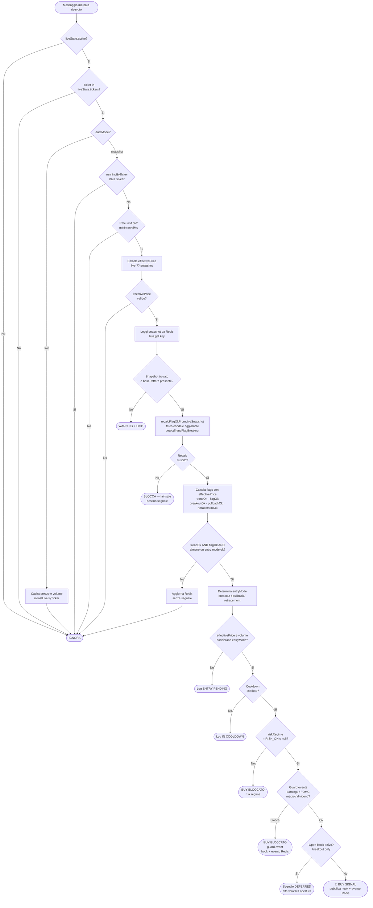
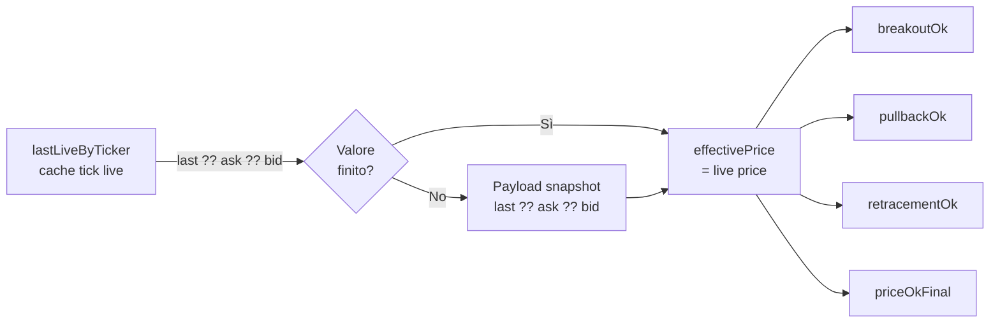
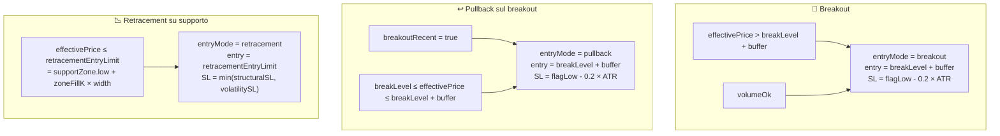
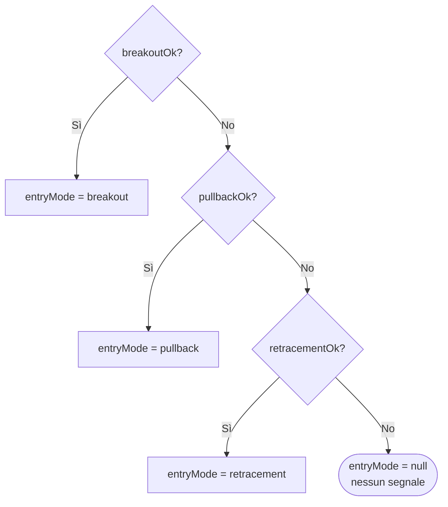
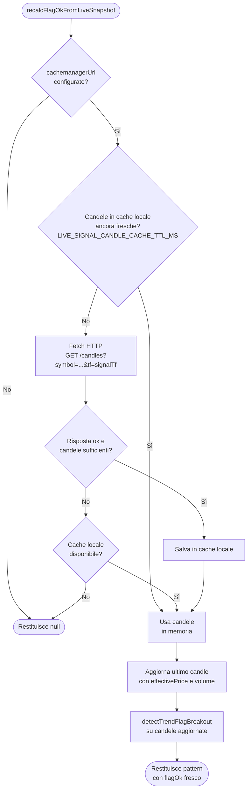
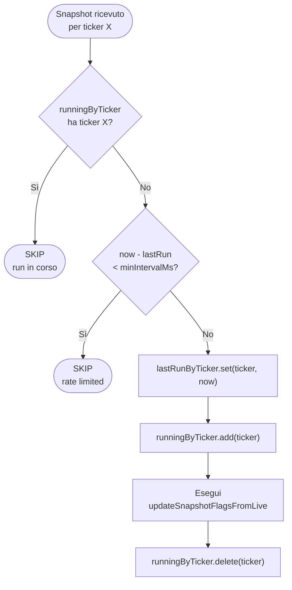
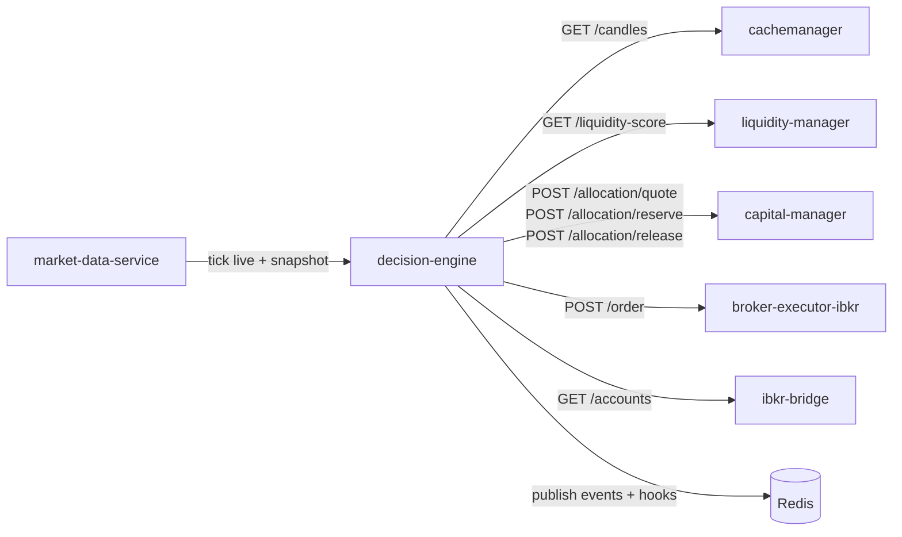

# Flusso Live (post-fix)

## Panoramica

Questa pagina descrive il flusso corretto del sistema live del `decision-engine` dopo l'applicazione dei fix documentati nella pagina principale.

Il sistema live si attiva quando:
1. Lo spot-finder ha completato l'analisi di una pipe (`POST /spot-finder/:pipeId`)
2. La modalità live è abilitata (`POST /spot-finder/live/:pipeId`)
3. I ticker con `trendOk = true` sono stati sottoscritti al `market-data-service`

Da quel momento, ogni messaggio di mercato ricevuto dal `market-data-service` viene processato dal handler live e valutato per l'emissione di un segnale BUY.

Il flusso si divide in due fasi distinte:
- **Fase 1 — Tick live** (`dataMode = "live"`): il prezzo viene solo cachato in memoria, nessuna logica viene eseguita
- **Fase 2 — Tick snapshot** (`dataMode = "snapshot"`): viene eseguita la valutazione completa del segnale

---

## Schema del flusso completo



---

## Fix 1 — Prezzo di riferimento unificato (effectivePrice)

Il fix principale introduce un **prezzo di riferimento unificato** chiamato `effectivePrice`, che sostituisce l'uso inconsistente di `price` e `livePrice` nella versione precedente.

### Logica di calcolo



### Perché questo è importante

Nella versione precedente `breakoutOk` veniva calcolato con `price` (snapshot) e il check finale usava `livePrice`. I due valori potevano divergere rendendo impossibile soddisfare entrambe le condizioni contemporaneamente.

Con `effectivePrice` unificato tutti i check usano lo stesso valore, eliminando la possibilità di discordanza.

### Codice post-fix

```javascript
// Calcola effectivePrice — unico prezzo di riferimento
const liveQuote = liveState.lastLiveByTicker.get(ticker);
const effectivePrice = Number.isFinite(liveQuote?.last ?? liveQuote?.ask ?? liveQuote?.bid)
  ? (liveQuote?.last ?? liveQuote?.ask ?? liveQuote?.bid)
  : price;

// Tutti i check usano effectivePrice
const priceOk = Number.isFinite(effectivePrice) && Number.isFinite(breakLevel)
  ? effectivePrice > breakLevel + buffer
  : false;
const breakoutOk = priceOk && volumeOk;

// Check finale coerente
const priceOkFinal = entryMode === "pullback"
  ? effectivePrice >= breakLevelPullback && effectivePrice <= breakLevelPullback + pullbackBuffer
  : entryMode === "retracement"
    ? effectivePrice <= retracementEntryLimit
    : effectivePrice >= entryLimit; // breakout
```

---

## Fix 2 — Separazione dei tre scenari di ingresso

Il fix chiarisce la distinzione tra tre scenari di ingresso, prima confusi sotto un'unica variabile `pullbackOk`.

### I tre scenari



### Priorità di selezione



### Codice post-fix

```javascript
// Breakout: prezzo sopra il flag high
const priceBreakoutOk = effectivePrice > breakLevel + buffer;
const breakoutOk = priceBreakoutOk && volumeOk;

// Pullback sul breakout: prezzo rientrato vicino al breakout level
const pullbackOk = breakoutRecent &&
  effectivePrice >= breakLevel &&
  effectivePrice <= breakLevel + buffer;

// Retracement su supporto: prezzo sceso nella zona di supporto
const retracementOk =
  Number.isFinite(retracementEntryLimit) &&
  effectivePrice <= retracementEntryLimit;

// Priorità: breakout > pullback > retracement
const entryMode = breakoutOk ? "breakout"
  : pullbackOk ? "pullback"
  : retracementOk ? "retracement"
  : null;
```

---

## Fix 3 — Recalc del flag con politica fail-safe

Il fix introduce una politica **fail-safe** per il recalc del flag: se non è possibile ricalcolare il pattern con dati freschi, il segnale viene bloccato invece di usare dati potenzialmente stantii da Redis.

### Flusso del recalc



### Politica post-fix sul risultato null

```javascript
const recalculatedPattern = await recalcFlagOkFromLiveSnapshot({
  ticker, price: effectivePrice, volume, cachemanagerUrl, logger,
});

// Fail-safe: se il recalc non è disponibile, non emettere segnali
if (recalculatedPattern === null) {
  logger?.warning?.(
    `[live] flagOk recalc non disponibile ticker=${ticker} — segnale bloccato (fail-safe)`
  );
  await bus.set(key, updated, { EX: SNAPSHOT_TTL_SECONDS });
  return true;
}

const flagOk = recalculatedPattern.flagOk;
```

### Perché fail-safe e non fail-open

Usare un `flagOk` stantio da Redis significa valutare un pattern calcolato ore prima, quando il prezzo era in una posizione diversa. Un falso segnale in condizioni di mercato cambiate è più pericoloso di un segnale mancato. La politica conservativa è preferibile in un sistema di trading automatico.

---

## Fix 4 — Reintroduzione del rate limit per ticker

Il fix reintroduce il rate limit per ticker che era presente nella versione originale ma rimosso nel refactoring.

### Logica del doppio guard



### Parametri configurabili

| Variabile env | Default | Descrizione |
|---|---|---|
| `LIVE_RECALC_INTERVAL_MS` | `60000` | Intervallo minimo tra due valutazioni dello stesso ticker (ms) |

### Codice post-fix

```javascript
const now = Date.now();

// Guard 1: nessun run in corso per questo ticker
if (liveState.runningByTicker.has(ticker)) {
  logger?.trace?.(`[live][trace] snapshot skipped ticker=${ticker}: run in corso`);
  return;
}

// Guard 2: rate limit
const lastRun = liveState.lastRunByTicker.get(ticker) || 0;
if (now - lastRun < liveState.minIntervalMs) {
  logger?.trace?.(
    `[live][trace] snapshot rate-limited ticker=${ticker} ` +
    `nextRunIn=${Math.ceil((liveState.minIntervalMs - (now - lastRun)) / 1000)}s`
  );
  return;
}

liveState.lastRunByTicker.set(ticker, now);
liveState.runningByTicker.add(ticker);

try {
  await updateSnapshotFlagsFromLive(ticker, effectivePrice, volume, dataMode, ts, liveData, deps);
} finally {
  liveState.runningByTicker.delete(ticker);
}
```

---

## Configurazione e dipendenze

### Variabili d'ambiente rilevanti

| Variabile | Default | Descrizione |
|---|---|---|
| `LIVE_RECALC_INTERVAL_MS` | `60000` | Rate limit tra valutazioni dello stesso ticker (ms) |
| `LIVE_SIGNAL_CANDLE_CACHE_TTL_MS` | `120000` | TTL cache locale delle candele signal per ticker (ms) |
| `LIVE_INTRADAY_TF` | `1min` | Timeframe per il check del candle range sul breakout |
| `MARKET_OPEN_UTC` | `14:30` | Orario apertura NYSE in UTC per il blocco apertura |
| `BREAKOUT_OPEN_BLOCK_MINUTES` | `25` | Minuti dall'apertura in cui i breakout sono bloccati |
| `RISK_ON_TTL_MS` | `60000` | TTL della cache del regime di rischio da liquidity-manager |
| `FMP_API_KEY` | — | API key Financial Modeling Prep (richiesta per i guard) |
| `DE_EARNINGS_GUARD_ENABLED` | `true` | Abilita il guard earnings |
| `EARNINGS_BLOCK_WEEKS` | `2` | Settimane di blocco prima/dopo earnings |
| `DE_FOMC_GUARD_ENABLED` | `true` | Abilita il guard FOMC |
| `DE_FOMC_BLOCK_DAYS` | `2` | Giorni di blocco prima del FOMC |
| `DE_MACRO_GUARD_ENABLED` | `true` | Abilita il guard macro (CPI, NFP) |
| `DE_MACRO_BLOCK_DAYS` | `1` | Giorni di blocco prima di eventi macro |
| `DE_DIVIDEND_GUARD_ENABLED` | `true` | Abilita il guard ex-dividend |
| `DE_DIVIDEND_BLOCK_DAYS` | `3` | Giorni di blocco prima dell'ex-date |
| `DE_DOLLARS_PER_TRADE` | `5000` | Capitale default per trade se capital-manager non disponibile |
| `DE_ORDER_TIF` | `DAY` | Time in force degli ordini IBKR |

### Dipendenze esterne del flusso live



Tutte le dipendenze sono chiamate in modo asincrono e non bloccano il flusso in caso di errore, ad eccezione di `capital-manager` in fase di quote: se risponde con rejection, l'ordine viene bloccato.
