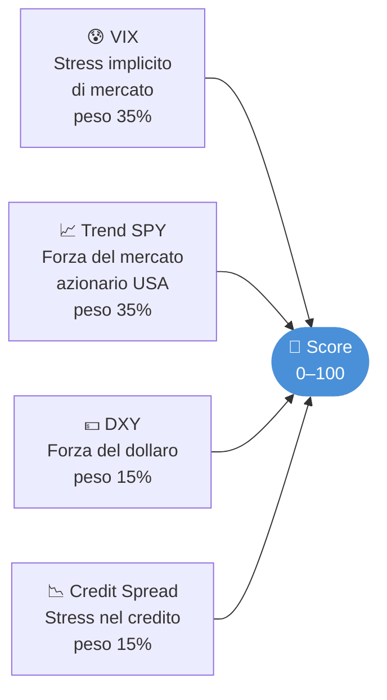
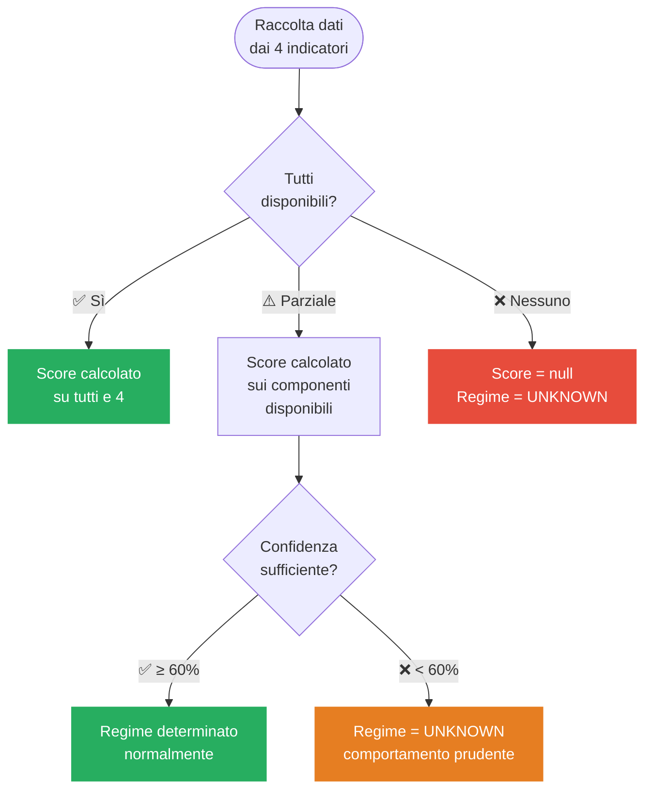
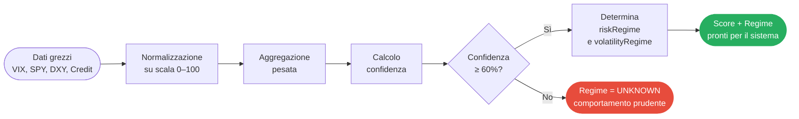
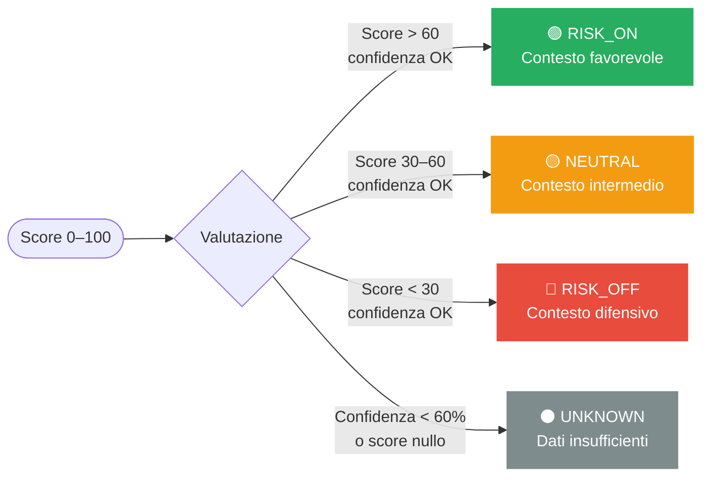

# Stabilizzazione score e regime

## Navigazione

1. Problema — Score istantaneo troppo reattivo
2. Sintomo osservato
3. Causa
4. Soluzioni proposte
5. Liquidity Manager — Documentazione base
6. Liquidity Manager — Fonti dati e componenti
7. Liquidity Manager — Calcolo dello score e dei regimi
8. Liquidity Manager — Miglioramenti aggiuntivi

## Problema — Score istantaneo troppo reattivo

## Sintomo osservato

Lo score del `liquidity-manager` varia troppo repentinamente da un giorno all'altro, causando l'attivazione continua dei meccanismi di riduzione o aumento del capitale investibile nel `capital-manager`.

## Causa

Lo score è un valore istantaneo calcolato sui dati live di VIX, SPY trend, DXY e credit spread. Questi input cambiano ogni giorno — il VIX in particolare può muoversi di 5-10 punti in una singola sessione.

Poiché il `capital-manager` usa lo score direttamente nella formula:

```
base = 0.70 - (score / 100) × 0.50
```

una variazione di 20 punti di score si traduce in una variazione di 10 punti percentuali di `reservedCashPct`. Con un account da $10.000 questo può spostare `maxInvestable` di $1.000 da un giorno all'altro senza che il contesto macro sia davvero cambiato.

Il problema è aggravato dai cambi di regime (`RISK_ON` → `NEUTRAL` → `RISK_OFF`): una variazione di score da 61 a 59 cambia il regime da `RISK_ON` a `NEUTRAL`, aggiungendo un ulteriore +0.10 a `reservedCashPct`, ma non indica nulla di significativo dal punto di vista macro. Il sistema diventa ipersensibile a rumore di breve periodo.

## Soluzioni proposte

## Soluzione 1 — EMA dello score (priorità alta, da implementare per prima)

Invece di usare lo score istantaneo, il `liquidity-manager` mantiene in Redis un'Exponential Moving Average dello score e la espone come `score_ema` accanto allo `score` grezzo.

L'EMA è preferibile alla SMA semplice perché:

- dà più peso ai dati recenti senza richiedere uno storico fisso
- se i dati mancano per un giorno non si perde la finestra
- si configura con un solo parametro (`alpha`)

```
// Alpha configurabile via DB setting
// alpha = 0.2 → EMA ≈ 9 giorni  (consigliato come default)
// alpha = 0.3 → EMA ≈ 6 giorni  (più reattivo)
// alpha = 0.1 → EMA ≈ 19 giorni (più stabile)

const alpha = getSetting("LIQ_EMA_ALPHA") || 0.2;

// Ad ogni calcolo dello score:
const prevEma = await redis.get("liquidity:score:ema") ?? score;
const newEma = alpha * score + (1 - alpha) * prevEma;
await redis.set("liquidity:score:ema", newEma);

// Risposta del liquidity-manager:
return {
  score,          // valore istantaneo (mantenuto per trasparenza)
  score_ema,      // valore smoothato → usato da capital-manager
  riskRegime,
  confidence,
  volatility,
};
```

### Impatto con alpha=0.2

Con un VIX che passa da 15 a 30 in un giorno (scenario di stress acuto):

|  | Score istantaneo | Score EMA (alpha=0.2) |
| --- | --- | --- |
| Giorno 0 | 72 | 72 |
| Giorno 1 (spike VIX) | 45 | 67 |
| Giorno 2 | 48 | 63 |
| Giorno 3 | 50 | 61 |
| Giorno 7 | 52 | 57 |

Lo score EMA scende gradualmente anziché fare un salto da 72 a 45 in un giorno. Il `capital-manager` riceve un segnale più stabile e la `reservedCashPct` si aggiusta in modo progressivo.

### Modifica al capital-manager

Il `capital-manager` deve leggere `score_ema` invece di `score` dalla risposta del `liquidity-manager`:

```
const liquidityScore = liquidityData.score_ema ?? liquidityData.score;
const base = 0.70 - (liquidityScore / 100) * 0.50;
```

Il campo `score` originale rimane disponibile nel payload per debug e monitoraggio.

## Soluzione 2 — Hysteresis sul cambio di regime (priorità alta)

I cambi di regime triggherano comportamenti binari nel `capital-manager` (+0.10 su `reservedCashPct` per `RISK_OFF`). Con le soglie attuali (RISK_OFF < 30, RISK_ON > 60), un'oscillazione di score tra 59 e 61 causa flip continui RISK_ON ↔ NEUTRAL.

La soluzione è una banda morta attorno alle soglie: il regime cambia solo quando lo score supera chiaramente la soglia, non quando oscilla attorno ad essa.

```
// Soglie con hysteresis
const REGIME_THRESHOLDS = {
  RISK_OFF: { enter: 28, exit: 34 },   // entra a <28, esce solo se >34
  RISK_ON:  { enter: 63, exit: 57 },   // entra a >63, esce solo se <57
  // NEUTRAL: zona residua tra 34 e 57
};

// Il regime corrente viene salvato in Redis
const currentRegime = await redis.get("liquidity:regime:current") || "NEUTRAL";

function computeRegimeWithHysteresis(score, currentRegime) {
  if (currentRegime === "RISK_OFF" && score > REGIME_THRESHOLDS.RISK_OFF.exit) {
    return score > REGIME_THRESHOLDS.RISK_ON.enter ? "RISK_ON" : "NEUTRAL";
  }
  if (currentRegime === "RISK_ON" && score < REGIME_THRESHOLDS.RISK_ON.exit) {
    return score < REGIME_THRESHOLDS.RISK_OFF.enter ? "RISK_OFF" : "NEUTRAL";
  }
  if (currentRegime === "NEUTRAL") {
    if (score < REGIME_THRESHOLDS.RISK_OFF.enter) return "RISK_OFF";
    if (score > REGIME_THRESHOLDS.RISK_ON.enter)  return "RISK_ON";
  }
  return currentRegime; // nessun cambio: rimane nel regime attuale
}
```

Con questa logica, un regime `RISK_ON` (score > 63) non viene abbandonato finché lo score non scende sotto 57 — una piccola oscillazione giornaliera non lo disturba.

## Soluzione 3 — Vincolo di variazione massima giornaliera

Approccio complementare, indipendente dall'EMA. Aggiunge un cap esplicito sulla variazione dello score tra un calcolo e il successivo:

```
const MAX_DAILY_CHANGE = getSetting("LIQ_MAX_DAILY_SCORE_CHANGE") || 8;

const prevScore = await redis.get("liquidity:score:prev") ?? score;
const delta = score - prevScore;
const clampedScore = prevScore + Math.max(-MAX_DAILY_CHANGE, Math.min(MAX_DAILY_CHANGE, delta));
await redis.set("liquidity:score:prev", clampedScore);
```

Con `MAX_DAILY_CHANGE = 8`, anche uno spike estremo del VIX sposta lo score di al massimo 8 punti al giorno. È più grezzo dell'EMA ma più facile da spiegare all'utente e da configurare intuitivamente.

Può coesistere con l'EMA: il rate limiting opera prima, l'EMA smootha ulteriormente.

## Soluzione 4 — Score fast e score slow (priorità media)

Questo è il consiglio più strategico. Il `liquidity-manager` attualmente produce un unico score usato per due scopi distinti:

- Sizing (quanto investire oggi) → ha senso che sia relativamente reattivo
- Regime (siamo in RISK_ON o RISK_OFF) → deve essere stabile per settimane

La separazione naturale è mantenere due EMA con alpha diversi:

```
// alpha_fast = 0.3 → EMA ≈ 6 giorni → per il sizing giornaliero
// alpha_slow = 0.1 → EMA ≈ 19 giorni → per il regime macro

const score_fast = alpha_fast * score + (1 - alpha_fast) * prevFast;
const score_slow = alpha_slow * score + (1 - alpha_slow) * prevSlow;
```

Il `capital-manager` usa `score_fast` nella formula di `reservedCashPct` e `score_slow` per la classificazione del regime e il relativo +0.10. Il sizing si adatta rapidamente ma il regime cambia solo quando il contesto macro è davvero cambiato.

## Ordine di implementazione consigliato

1. EMA dello score con `alpha = 0.2` — risolve il problema principale con circa 15 righe di codice, impatto immediato
2. Hysteresis sul regime — elimina i flip continui RISK_ON/OFF, indipendente dall'EMA
3. Rate limiting giornaliero — opzionale, come ulteriore salvaguardia durante eventi estremi (flash crash, Fed announcement)
4. Score fast/slow — da valutare dopo la validazione in produzione di 1 e 2

## Parametri da aggiungere alla configurazione

| Setting | Valore default | Descrizione |
| --- | --- | --- |
| `LIQ_EMA_ALPHA` | `0.2` | Alpha per EMA score (0.1 = stabile, 0.3 = reattivo) |
| `LIQ_MAX_DAILY_SCORE_CHANGE` | `8` | Variazione massima score per ciclo di calcolo |
| `LIQ_REGIME_RISK_OFF_ENTER` | `28` | Soglia di ingresso RISK_OFF (con hysteresis) |
| `LIQ_REGIME_RISK_OFF_EXIT` | `34` | Soglia di uscita RISK_OFF |
| `LIQ_REGIME_RISK_ON_ENTER` | `63` | Soglia di ingresso RISK_ON |
| `LIQ_REGIME_RISK_ON_EXIT` | `57` | Soglia di uscita RISK_ON |
| `LIQ_EMA_ALPHA_FAST` | `0.3` | Alpha EMA fast (per sizing) — solo se implementata Soluzione 4 |
| `LIQ_EMA_ALPHA_SLOW` | `0.1` | Alpha EMA slow (per regime) — solo se implementata Soluzione 4 |

## Priorità

Alta — il problema causa un comportamento erratico del `capital-manager` che riduce e aumenta il capitale investibile ogni giorno anche in assenza di cambiamenti macroeconomici reali. Le soluzioni 1 e 2 sono indipendenti, richiedono meno di 2 ore ciascuna e non introducono breaking changes nell'API.

---

## Liquidity Manager — Documentazione base

Il **liquidity-manager** è il servizio che osserva continuamente il mercato e risponde a una domanda semplice: **è un momento favorevole per investire, o è meglio stare fermi?**

Non sceglie quali titoli comprare — questo è compito del decision-engine. Il suo ruolo è fornire una lettura del **contesto macro** in cui le operazioni si svolgono: se il mercato è in una fase di rischio elevato, il sistema automaticamente si fa più prudente, riduce l'esposizione e trattiene più liquidità. Se il mercato è in una fase favorevole, il sistema può operare con maggiore aggressività.

---

## In sintesi

| Voce | Dettaglio |
|------|-----------|
| **Scopo** | Misurare la qualità del contesto di mercato in tempo reale |
| **Output** | `score` (0–100), regime operativo, regime di volatilità, confidenza |
| **Chi lo usa** | capital-manager (per calibrare la riserva di liquidità), decision-engine (guardrail macro) |

---

## I quattro segnali di mercato analizzati

Il servizio combina quattro indicatori, ciascuno con un peso che riflette la sua importanza nel determinare il contesto di rischio:



Un **score alto** (vicino a 100) indica un mercato favorevole al rischio. Un **score basso** (vicino a 0) indica stress, incertezza o condizioni difensive.

---

## Come influenza il sistema

Il risultato del liquidity-manager si propaga direttamente su due livelli:

- **Capital-manager**: uno score alto riduce la quota di cash tenuta in riserva, rendendo disponibile più capitale per le operazioni. Uno score basso fa l'opposto.
- **Decision-engine**: il regime operativo (`RISK_ON`, `NEUTRAL`, `RISK_OFF`) viene usato come guardrail macro — in regime RISK_OFF certi segnali di acquisto vengono bloccati prima ancora di arrivare al capital-manager.

---

## Argomenti in questa sezione

- [Fonti dati e componenti](#liquidity-manager--fonti-dati-e-componenti) — i quattro indicatori usati e come reagisce il sistema se uno non è disponibile
- [Calcolo dello score e dei regimi](#liquidity-manager--calcolo-dello-score-e-dei-regimi) — come si passa dai dati grezzi a score, regime e confidenza

---

## Liquidity Manager — Fonti dati e componenti

Il liquidity-manager costruisce la sua valutazione del mercato combinando quattro indicatori indipendenti. Ogni indicatore ha un peso nel calcolo dello score finale e viene recuperato da fonti esterne che il sistema interroga automaticamente.

---

## I quattro indicatori

### 😰 VIX — Indice della paura (peso 35%)

Il VIX misura quanto il mercato si aspetta volatilità nelle prossime settimane sull'azionario americano. Viene spesso chiamato "indice della paura": quando sale, gli investitori sono preoccupati; quando è basso, c'è calma.

- **VIX basso (≤ 15)**: mercato tranquillo, propensione al rischio alta
- **VIX medio (15–25)**: fase di transizione, incertezza moderata
- **VIX alto (≥ 25)**: stress elevato, mercato difensivo

Il sistema lo recupera da Stooq, con fallback automatico su FRED (`VIXCLS`).

---

### 📈 Trend SPY — Forza del mercato azionario USA (peso 35%)

SPY è l'ETF più liquido che replica l'S&P 500. Analizzare il suo trend nel tempo permette di capire se il mercato azionario americano è in una fase di salita sostenuta, laterale o di discesa.

Un trend positivo è un segnale favorevole all'ingresso; un trend negativo o piatto suggerisce cautela.

Il sistema usa lo storico di SPY da Stooq per calcolare medie mobili e determinare la direzione del trend.

---

### 💵 DXY — Forza del dollaro (peso 15%)

Il DXY è l'indice che misura il valore del dollaro americano rispetto a un paniere di valute principali (euro, yen, sterlina, ecc.). È un proxy delle condizioni finanziarie globali.

- **Dollaro forte (DXY in salita)**: spesso associato a condizioni finanziarie più restrittive, pressione sulle asset rischiose
- **Dollaro debole (DXY in discesa)**: condizioni più accomodanti, favorevole al rischio

Il sistema supporta più fonti configurabili (FRED, Yahoo, Stooq) con fallback automatico.

---

### 📉 Credit Spread — Stress nel credito (peso 15%)

Lo spread creditizio misura la differenza di rendimento tra obbligazioni corporate e titoli di stato. Quando gli investitori temono insolvenze aziendali, lo spread si allarga — e questo è un segnale di stress nell'economia reale che precede spesso correzioni azionarie.

Il sistema usa la serie FRED `BAA10Y` come default. Questo componente può essere disabilitato via configurazione se lo si ritiene non necessario.

---

## Robustezza: cosa succede se una fonte non risponde

Il sistema è progettato per continuare a funzionare anche con dati parziali. Se un indicatore non è disponibile (API esterna down, dati mancanti, errore di rete), non blocca l'intero servizio:



Quando uno o più componenti mancano, il sistema:
- **Ricalcola lo score** usando solo i componenti disponibili (i pesi vengono rinormalizzati)
- **Abbassa la confidenza** proporzionalmente al peso dei dati mancanti
- **Forza il regime a UNKNOWN** se la confidenza scende sotto il 60%

Questo significa che il sistema non prende mai decisioni aggressive con dati incompleti.

---

## Riepilogo fonti per componente

| Componente | Peso | Fonte primaria | Fallback | Disabilitabile |
|------------|------|----------------|----------|----------------|
| VIX | 35% | Stooq | FRED (VIXCLS) | No |
| Trend SPY | 35% | Stooq | — | No |
| DXY | 15% | FRED | Yahoo / Stooq | Sì |
| Credit Spread | 15% | FRED (BAA10Y) | — | Sì |

---

## Liquidity Manager — Calcolo dello score e dei regimi

Partendo dai quattro indicatori di mercato, il liquidity-manager produce tre valori che guidano il comportamento dell'intero sistema: lo **score** (0–100), il **regime operativo** e il **regime di volatilità**. Ecco come vengono calcolati.

---

## Il flusso di calcolo



---

## Passo 1 — Normalizzazione

Ogni indicatore viene convertito su una scala da 0 a 100 dove **100 = contesto favorevole al rischio** e **0 = massimo stress**. La logica è inversa per alcuni indicatori:

| Indicatore | Logica di normalizzazione |
|------------|--------------------------|
| VIX | VIX alto → score basso (più stress = meno favorevole) |
| Trend SPY | Trend positivo → score alto |
| DXY | Dipende dalla configurazione; dollaro forte tende a score più basso |
| Credit Spread | Spread ampio → score basso (più stress creditizio) |

---

## Passo 2 — Aggregazione pesata

Lo score finale è la media pesata dei soli componenti disponibili. Se una fonte manca, i pesi degli altri vengono rinormalizzati automaticamente:

```
score = Σ (punteggio_componente × peso_componente) / Σ (pesi_disponibili)
```

**Esempio:** Se solo VIX (35%) e SPY (35%) sono disponibili, lo score viene calcolato come media dei due pesata al 50% ciascuno — i pesi di DXY e Credit vengono distribuiti proporzionalmente.

---

## Passo 3 — Confidenza

La **confidenza** misura quanta parte del modello è coperta da dati reali. È un numero tra 0 e 1:

```
confidenza = peso dei componenti disponibili / peso totale configurato
```

| Scenario | Componenti disponibili | Confidenza |
|----------|----------------------|------------|
| Tutti e 4 | VIX + SPY + DXY + Credit | 1.00 (100%) |
| Solo i principali | VIX + SPY | 0.70 (70%) |
| Solo uno | VIX | 0.35 (35%) |
| Nessuno | — | 0.00 (0%) |

Se la confidenza scende sotto **0.60** (60%), il sistema non si fida abbastanza dei dati per determinare un regime — e imposta `UNKNOWN` come comportamento prudente.

---

## Passo 4 — Regime operativo (riskRegime)

Il regime operativo è il **semaforo** che il sistema usa per decidere se i nuovi ingressi long sono appropriati:



### Cosa significa per il tuo trading

| Regime | Cosa succede nel sistema |
|--------|------------------------|
| **RISK_ON** | Contesto più favorevole. Il capital-manager riduce la riserva di liquidità. Il decision-engine permette nuovi ingressi long. |
| **NEUTRAL** | Contesto intermedio. Il sistema opera normalmente ma con maggiore selettività. |
| **RISK_OFF** | Contesto difensivo. Il capital-manager aggiunge un +10% di riserva. Alcuni guardrail del decision-engine diventano più restrittivi. |
| **UNKNOWN** | Dati insufficienti o inaffidabili. Il sistema si comporta in modo prudente, simile a RISK_OFF. |

---

## Passo 5 — Regime di volatilità (volatilityRegime)

Derivato direttamente dal valore del VIX, indipendentemente dallo score aggregato:

| Valore VIX | Regime volatilità | Significato pratico |
|-----------|------------------|---------------------|
| ≤ 15 | 🟢 `LOW` | Mercato tranquillo, bassa incertezza |
| 15–25 | 🟡 `NORMAL` | Volatilità nella norma storica |
| ≥ 25 | 🔴 `HIGH` | Stress elevato, alta incertezza |
| VIX non disponibile | ⚫ `UNKNOWN` | Impossibile determinare |

Il regime di volatilità viene usato dal capital-manager per applicare un aggiustamento aggiuntivo sulla riserva di liquidità: maggiore è la volatilità, più cash viene trattenuto.

---

## Come leggere lo score in pratica

Lo score da solo non basta: va letto insieme alla confidenza. Un punteggio di 75 con confidenza 1.0 è molto più affidabile di un 75 con confidenza 0.40.

| Score | Confidenza | Interpretazione |
|-------|-----------|-----------------|
| 80 | 1.00 | ✅ Forte segnale RISK_ON, dati completi |
| 80 | 0.40 | ⚠️ Score positivo ma dati parziali → regime UNKNOWN |
| 25 | 0.85 | 🔴 Forte segnale RISK_OFF, affidabile |
| 45 | 0.70 | 🟡 NEUTRAL, dati buoni |
| — | 0.00 | ⚫ Nessun dato disponibile |

---

## Liquidity Manager — Miglioramenti aggiuntivi

> **Documento di lavoro** — da usare come riferimento per l'implementazione.  
> Tutti i parametri sono configurabili via DB setting e hanno un valore default ragionevole.

---

## Contesto del problema

Lo score del `liquidity-manager` è un **valore istantaneo** calcolato su dati live (VIX, SPY trend, DXY, credit spread). Questi input cambiano ogni giorno — il VIX può muoversi di 5–10 punti in una singola sessione. Poiché il `capital-manager` usa lo score direttamente nella formula:

```
base = 0.70 - (score / 100) × 0.50
```

una variazione di 20 punti di score si traduce in **10 punti percentuali** di `reservedCashPct`, potenzialmente spostando `maxInvestable` di centinaia di dollari da un giorno all'altro senza che il contesto macro sia davvero cambiato.

Problema secondario: la gestione della `confidence` (0–1) è binaria — sopra soglia tutto ok, sotto soglia tutto ignorato. Questo è troppo brusco e genera comportamenti erratici nei casi limite.

---

## Blocco 1 — Smoothing dello score

### 1A. EMA dello score (priorità ALTA)

Invece dello score istantaneo, il `liquidity-manager` mantiene in Redis una **Exponential Moving Average** dello score e la espone come `score_ema` accanto allo `score` grezzo.

L'EMA è preferibile alla SMA semplice perché:
- dà più peso ai dati recenti senza richiedere uno storico fisso
- se i dati mancano per un giorno non si perde la finestra
- si configura con un solo parametro (`alpha`)

```javascript
const alpha_base = getSetting("LIQ_EMA_ALPHA") || 0.2;
// alpha = 0.2 → EMA ≈ 9 giorni  (consigliato)
// alpha = 0.3 → EMA ≈ 6 giorni  (più reattivo)
// alpha = 0.1 → EMA ≈ 19 giorni (più stabile)

const prevEma = await redis.get("liquidity:score:ema") ?? score;
const newEma = alpha_base * score + (1 - alpha_base) * prevEma;
await redis.set("liquidity:score:ema", newEma);
```

**Impatto con alpha=0.2** — scenario spike VIX (score istantaneo 72 → 45 in un giorno):

| Giorno | Score istantaneo | Score EMA |
|--------|-----------------|-----------|
| 0      | 72              | 72        |
| 1 (spike) | 45           | 67        |
| 2      | 48              | 63        |
| 3      | 50              | 61        |
| 7      | 52              | 57        |

**Modifica al `capital-manager`:**

```javascript
// Prima: usa score direttamente
// Dopo: legge score_ema dalla risposta del liquidity-manager
const liquidityScore = liquidityData.score_ema ?? liquidityData.score;
const base = 0.70 - (liquidityScore / 100) * 0.50;
```

Il campo `score` originale rimane nel payload per debug e monitoring.

---

### 1B. Rate limiting sulla variazione giornaliera (complementare a EMA)

Cap esplicito sulla variazione massima dello score per ciclo di calcolo. Più grezzo dell'EMA ma più intuitivo da configurare.

```javascript
const MAX_DAILY_CHANGE = getSetting("LIQ_MAX_DAILY_SCORE_CHANGE") || 8;

const prevScore = await redis.get("liquidity:score:prev") ?? score;
const delta = score - prevScore;
const clampedScore = prevScore + Math.max(-MAX_DAILY_CHANGE, Math.min(MAX_DAILY_CHANGE, delta));
await redis.set("liquidity:score:prev", clampedScore);
```

Con `MAX_DAILY_CHANGE = 8`, anche uno spike estremo sposta lo score di al massimo 8 punti al giorno.  
Può coesistere con l'EMA: il rate limiting opera prima, l'EMA smootha ulteriormente.

---

## Blocco 2 — Stabilizzazione del regime

### 2A. Hysteresis sul cambio di regime (priorità ALTA)

I cambi di regime (`RISK_ON` → `NEUTRAL` → `RISK_OFF`) triggherano comportamenti binari nel `capital-manager` (+0.10 su `reservedCashPct` per `RISK_OFF`). Con le soglie attuali (RISK_OFF < 30, RISK_ON > 60), un'oscillazione tra 59 e 61 causa flip continui.

La soluzione è una **banda morta** attorno alle soglie: il regime cambia solo quando lo score supera chiaramente la soglia di uscita, non quando oscilla attorno a quella di ingresso.

```javascript
const REGIME_THRESHOLDS = {
  RISK_OFF: { enter: 28, exit: 34 },  // entra se <28, esce solo se >34
  RISK_ON:  { enter: 63, exit: 57 },  // entra se >63, esce solo se <57
  // NEUTRAL: zona residua tra 34 e 57
};

// Il regime corrente viene salvato in Redis
const currentRegime = await redis.get("liquidity:regime:current") || "NEUTRAL";

function computeRegimeWithHysteresis(score, currentRegime) {
  if (currentRegime === "RISK_OFF" && score > REGIME_THRESHOLDS.RISK_OFF.exit) {
    return score > REGIME_THRESHOLDS.RISK_ON.enter ? "RISK_ON" : "NEUTRAL";
  }
  if (currentRegime === "RISK_ON" && score < REGIME_THRESHOLDS.RISK_ON.exit) {
    return score < REGIME_THRESHOLDS.RISK_OFF.enter ? "RISK_OFF" : "NEUTRAL";
  }
  if (currentRegime === "NEUTRAL") {
    if (score < REGIME_THRESHOLDS.RISK_OFF.enter) return "RISK_OFF";
    if (score > REGIME_THRESHOLDS.RISK_ON.enter)  return "RISK_ON";
  }
  return currentRegime; // nessun cambio
}

await redis.set("liquidity:regime:current", newRegime);
```

Con questa logica un regime `RISK_ON` (score > 63) non viene abbandonato finché lo score non scende sotto 57. Una piccola oscillazione giornaliera non lo disturba.

---

### 2B. Score fast e score slow — separazione sizing vs regime (priorità MEDIA)

Il `liquidity-manager` produce un unico score usato per due scopi distinti:

- **Sizing** (quanto investire oggi) → ha senso che sia relativamente reattivo
- **Regime** (siamo in RISK_ON o RISK_OFF) → deve essere stabile per settimane

La separazione naturale è mantenere **due EMA con alpha diversi**:

```javascript
const alpha_fast = getSetting("LIQ_EMA_ALPHA_FAST") || 0.3; // ≈ 6 giorni
const alpha_slow = getSetting("LIQ_EMA_ALPHA_SLOW") || 0.1; // ≈ 19 giorni

const score_fast = alpha_fast * score + (1 - alpha_fast) * prevFast;
const score_slow = alpha_slow * score + (1 - alpha_slow) * prevSlow;

await redis.set("liquidity:score:ema_fast", score_fast);
await redis.set("liquidity:score:ema_slow", score_slow);
```

**Nel `capital-manager`:**
- `score_fast` → usato nella formula `base = 0.70 - (score/100) × 0.50`
- `score_slow` → usato per la classificazione del regime e il relativo +0.10

Il sizing si adatta rapidamente, il regime cambia solo quando il contesto macro è davvero cambiato.

> **Nota:** implementare dopo aver validato in produzione l'EMA base + hysteresis.

---

## Blocco 3 — Gestione confidence degradata

### 3A. Alpha dell'EMA scalato per confidence (priorità ALTA)

**Problema attuale:** la gestione della `confidence` è binaria — sopra 0.60 tutto ok, sotto 0.60 score completamente ignorato. Se la confidence scende a 0.55 (manca solo il credit spread), lo score viene buttato via anche se VIX e SPY trend sono disponibili.

**Soluzione:** quando arriva uno score con confidence ridotta, lo si incorpora nell'EMA con un **peso proporzionale alla confidence**:

```javascript
const alpha_base = getSetting("LIQ_EMA_ALPHA") || 0.2;

// confidence=1.0 → alpha_effective = 0.20 (aggiornamento normale)
// confidence=0.6 → alpha_effective = 0.12 (aggiornamento ridotto)
// confidence=0.3 → alpha_effective = 0.06 (contributo minimo)
// confidence=0.0 → alpha_effective = 0.00 (EMA non aggiornata)
const alpha_effective = alpha_base * confidence;

const LIQ_CONFIDENCE_MIN_FOR_UPDATE = getSetting("LIQ_CONFIDENCE_MIN_FOR_UPDATE") || 0.30;

if (confidence >= LIQ_CONFIDENCE_MIN_FOR_UPDATE) {
  const newEma = alpha_effective * score + (1 - alpha_effective) * prevEma;
  await redis.set("liquidity:score:ema", newEma);
  await redis.set("liquidity:score:alpha_last", alpha_effective); // per debug
} else {
  // Attiva il decay (vedi 3B)
}
```

---

### 3B. Decay esponenziale verso valore neutro in assenza di dati (priorità ALTA)

Se la confidence è troppo bassa o il servizio non risponde, l'EMA **non deve restare congelata** — deve scivolare lentamente verso un valore neutro/conservativo riflettendo l'incertezza crescente:

```javascript
const NEUTRAL_SCORE = getSetting("LIQ_EMA_NEUTRAL_TARGET") || 50;
const DECAY_RATE    = getSetting("LIQ_EMA_DECAY_RATE")     || 0.05;

// Se confidence < 0.30 o score non disponibile:
const newEma = prevEma + DECAY_RATE * (NEUTRAL_SCORE - prevEma);
await redis.set("liquidity:score:ema", newEma);
await redis.set("liquidity:score:staleness_days",
  (parseInt(await redis.get("liquidity:score:staleness_days") || "0")) + 1
);
```

**Effetto su un'EMA a 80 che perde i dati:**

| Giorni senza dati | EMA |
|-------------------|-----|
| 0                 | 80  |
| 1                 | 77  |
| 3                 | 71.5|
| 7                 | 63.5|
| 14                | 55  |
| ∞                 | 50  |

Converge verso 50 senza mai fare salti bruschi. Corretto di congelare: l'incertezza crescente si riflette gradualmente.

Il campo `ema_staleness_days` viene resettato a 0 ogni volta che arriva un aggiornamento con confidence sufficiente.

---

### 3C. Aggiustamento regime proporzionale alla confidence (priorità MEDIA)

L'aggiustamento `RISK_OFF → +0.10` nel `capital-manager` diventa proporzionale alla confidence invece che binario:

```javascript
// Attuale (binario):
// confidence >= 0.60 e RISK_OFF → base += 0.10
// confidence <  0.60            → fallback fisso 0.60

// Proposto (continuo):
const LIQ_MIN_CONFIDENCE_FOR_REGIME = getSetting("LIQ_MIN_CONFIDENCE_FOR_REGIME") || 0.60;
const confidenceRatio = Math.min(confidence / LIQ_MIN_CONFIDENCE_FOR_REGIME, 1.0);

const riskOffAdjustment = (riskRegime === "RISK_OFF") ? 0.10 * confidenceRatio : 0;
base += riskOffAdjustment;
```

Con confidence = 0.42 (soglia 0.60): `confidenceRatio = 0.70` → aggiustamento = +0.07 invece del salto binario. La transizione è continua e proporzionale alla qualità del dato.

---

## Schema del flusso completo

```
Ogni ciclo di calcolo:
│
├─ Score grezzo calcolato, confidence C
│
├─ C >= LIQ_CONFIDENCE_MIN_FOR_UPDATE (default 0.30)
│    alpha_effective = alpha_base × C
│    score_ema = alpha_effective × score + (1 - alpha_effective) × prevEma
│    staleness_days = 0
│    regime = computeRegimeWithHysteresis(score_ema, currentRegime)
│    riskOff_adj = 0.10 × min(C / soglia_regime, 1.0)
│
└─ C < 0.30 o score non disponibile
     score_ema = prevEma + DECAY_RATE × (NEUTRAL_TARGET - prevEma)
     staleness_days += 1
     regime = UNKNOWN se staleness_days > LIQ_MAX_STALENESS_BEFORE_UNKNOWN (default 3)
     riskOff_adj = 0

Output arricchito:
{
  score,              // valore istantaneo (per debug)
  score_ema,          // valore smoothato → usato da capital-manager
  confidence,
  riskRegime,
  volatilityRegime,
  alpha_effective,    // alpha usato nell'ultimo aggiornamento
  decay_applied,      // true se aggiornamento da decay invece che da score
  ema_staleness_days  // giorni dall'ultimo aggiornamento pieno
}
```

---

## Tabella completa dei parametri

| Setting | Default | Descrizione |
|---------|---------|-------------|
| `LIQ_EMA_ALPHA` | `0.2` | Alpha EMA base (0.1=stabile, 0.3=reattivo) |
| `LIQ_EMA_ALPHA_FAST` | `0.3` | Alpha EMA fast per sizing (solo se implementata Soluzione 2B) |
| `LIQ_EMA_ALPHA_SLOW` | `0.1` | Alpha EMA slow per regime (solo se implementata Soluzione 2B) |
| `LIQ_MAX_DAILY_SCORE_CHANGE` | `8` | Variazione massima score per ciclo di calcolo |
| `LIQ_REGIME_RISK_OFF_ENTER` | `28` | Soglia di ingresso RISK_OFF (con hysteresis) |
| `LIQ_REGIME_RISK_OFF_EXIT` | `34` | Soglia di uscita RISK_OFF |
| `LIQ_REGIME_RISK_ON_ENTER` | `63` | Soglia di ingresso RISK_ON |
| `LIQ_REGIME_RISK_ON_EXIT` | `57` | Soglia di uscita RISK_ON |
| `LIQ_EMA_CONFIDENCE_SCALE` | `true` | Abilita scaling alpha per confidence |
| `LIQ_CONFIDENCE_MIN_FOR_UPDATE` | `0.30` | Soglia minima confidence per aggiornare EMA |
| `LIQ_EMA_DECAY_RATE` | `0.05` | Tasso decay verso neutro per ciclo senza dati |
| `LIQ_EMA_NEUTRAL_TARGET` | `50` | Valore verso cui decadere in assenza di dati |
| `LIQ_MAX_STALENESS_BEFORE_UNKNOWN` | `3` | Giorni senza dati prima di forzare regime UNKNOWN |
| `LIQ_REGIME_CONFIDENCE_SCALE` | `true` | Aggiustamento regime proporzionale alla confidence |

---

## Ordine di implementazione consigliato

| # | Cosa | Stima | Priorità |
|---|------|-------|----------|
| 1 | EMA dello score (1A) + modifica capital-manager | ~1h | Alta |
| 2 | Hysteresis sul regime (2A) | ~1h | Alta |
| 3 | Alpha scalato per confidence (3A) | ~30min | Alta |
| 4 | Decay verso neutro (3B) | ~30min | Alta |
| 5 | Rate limiting giornaliero (1B) | ~30min | Media |
| 6 | Regime proporzionale alla confidence (3C) | ~1h | Media |
| 7 | Score fast/slow (2B) | ~1h | Bassa — dopo validazione in prod |

**Totale stimato passi 1–6:** ~4.5 ore  
**Nessun breaking change sull'API** — `score_ema` è un campo aggiuntivo, `score` rimane invariato.

---

## Note implementative

- Tutti i valori EMA/regime salvati in Redis devono avere una **TTL** sufficientemente lunga (es. 30 giorni) per sopravvivere ai riavvii del servizio senza perdere lo storico smoothato
- Al primo avvio (Redis vuoto), inizializzare `score_ema = score` e `staleness_days = 0`
- Aggiungere i nuovi campi (`score_ema`, `alpha_effective`, `decay_applied`, `ema_staleness_days`) al payload di risposta di `GET /liquidity-score` senza rimuovere quelli esistenti
- Aggiungere i nuovi settings alla tabella di configurazione DB con i valori default

---

*Documento generato il 21 marzo 2026 — da importare nella pagina roadmap `liquidity-manager-stabilizzazione-score` quando il server è stabile.*
